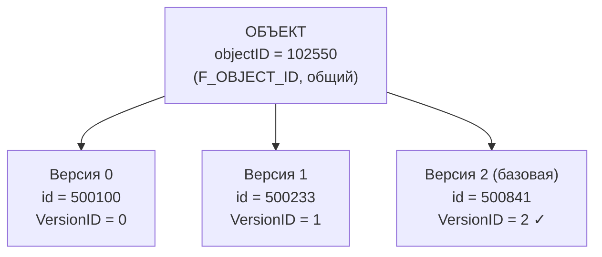

# Объект и версия

Это самая важная страница раздела. Если усвоить только одно про IPS — пусть это будет различие
между **объектом** и **версией**.

## Простыми словами

В IPS у каждой сущности два уровня идентичности:

- **Объект** — то, что существует «вообще»: деталь, документ, изделие. У него есть долгоживущий
  идентификатор, общий для всей его истории.
- **Версия** — конкретный снимок этого объекта во времени: «как объект выглядел в такой-то
  редакции». У каждой версии — свой отдельный идентификатор.

**Аналогия со статьёй в вики.** Статья — это объект: у неё постоянный адрес, она одна. Каждая
правка статьи — версия: своя дата, свой номер, своё содержимое. «Открой статью» обращается к
объекту; «покажи правку №7» — к версии. У объекта много версий; ровно одна из них в каждый
момент считается **базовой** (актуальной).



## Точные детали

В REST-ответах IPS (DTO) два разных набора полей идентичности. В `aioips` они доступны как
поля `ObjectDto` (`object_id`, `object_guid`, `id`, `guid`).

| Уровень | Поле в DTO | Поле в БД | Тип | Смысл |
|---|---|---|---|---|
| **Объект** | `objectID` (`object_id`) | `F_OBJECT_ID` | BIGINT | Идентификатор объекта, **общий для всех его версий** |
| **Объект** | `objectGUID` (`object_guid`) | — | GUID | GUID объекта |
| **Версия** | `id` | `F_ID` | BIGINT | Идентификатор конкретной версии (уникален per-version) |
| **Версия** | `guid` | — | GUID | GUID версии |
| **Версия** | `versionID` | `F_VERSION_ID` | INT | Порядковый номер версии (0 у базовой) |

Дополнительные признаки версии: `IsBaseVersion` (`F_BASE_VERSION`) — является ли версия базовой
(актуальной); `ParentVersionID` — версия-родитель; `ObjectVerType` (`F_OBJECT_VER_TYPE`):
`-1` рабочая копия / `0` обычная / `1` версия web-клиента.

!!! warning "objectID ≠ id версии — частая ошибка"
    Имена в REST местами вводят в заблуждение, а оба значения — это числа, поэтому компилятор
    подмену не заметит. Запомните правило:

    - Методы, которые работают с **объектом целиком** (`object_get`, `object_attributes`,
      `objects_collection` принимает список **id версий**, `object_check_out`), принимают
      `objectID` / `F_OBJECT_ID`.
    - Методы, которые работают с **конкретной версией** (например, `object_composition` берёт
      `projectVersionId` = id ВЕРСИИ; в связях `partID` = id версии потомка), принимают
      `id` / `F_ID`.

    Проверено на проде: `object_get(F_OBJECT_ID)` → объект; `object_get(F_ID)` → `None`
    (молча, без ошибки). Если метод вернул `None` там, где объект точно есть, — первое, что
    стоит проверить, не передали ли вы id версии вместо id объекта.

### Какой метод что принимает

| Метод `aioips` | Что принимает | id-пространство |
|---|---|---|
| `object_get(object_id)` | один объект → его базовая версия | **objectID** (объект) |
| `object_get_by_guid(guid)` | один объект по GUID объекта | **objectGUID** (объект) |
| `object_attributes(object_id)` | атрибуты объекта | **objectID** (объект) |
| `objects_collection([...])` | пакет объектов по списку id версий | **id версий** |
| `object_check_out(object_id)` | извлечь объект на редактирование | **objectID** (объект) |
| `object_composition(project_version_id)` | состав по версии проекта | **id версии** |
| `relation_get(...).part_id` | потомок в связи | **id версии** |
| `relation_get(...).proj_id` | родитель в связи | **objectID** (объект) |

## Как это выглядит в коде aioips

Чтение объекта по идентификатору объекта:

!!! example "Получить объект и его поля идентичности"
    ```python
    async with IPSClient(config=config) as ips:
        obj = await ips.object_get(102550)   # 102550 = objectID, НЕ id версии
        if obj is not None:
            print("объект :", obj.object_id, obj.object_guid)  # общий для версий
            print("версия :", obj.id, obj.guid)                # эта конкретная версия
            print("заголовок:", obj.caption)
    ```

Типичный антипаттерн — взять `part_id` из связи (это id версии) и подать в `object_get`:

!!! warning "Так делать нельзя"
    ```python
    relation = await ips.relation_get(700123)
    # relation.part_id — это id ВЕРСИИ потомка (F_ID), а не objectID!
    wrong = await ips.object_get(relation.part_id)   # вернёт None — пространство id не то

    # Правильно: брать objectID родителя из связи
    parent = await ips.object_get(relation.proj_id)  # proj_id = objectID родителя ✓
    ```

## Что дальше

- [Атрибуты и типы](attributes.md) — что хранится внутри версии объекта.
- [Жизненный цикл](lifecycle.md) — откуда берутся версии и когда объект можно менять.
- [Связи и состав](relations-composition.md) — как `projID` и `partID` соединяют объект и версию.
