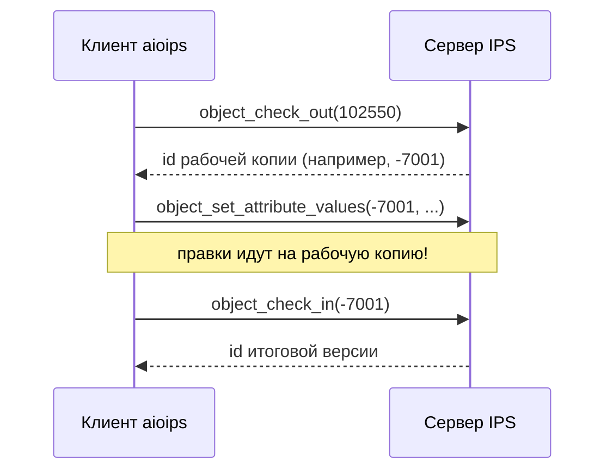

# Жизненный цикл и редактирование

Объекты в IPS не «лежат и редактируются как файлы». У каждого типа объекта есть **жизненный цикл**
(ЖЦ) — формализованный путь от создания до архива, и то, **можно ли менять объект прямо сейчас**,
зависит от того, на каком шаге ЖЦ он находится.

## Простыми словами

Аналогия — статья в редакции газеты. Статья проходит этапы: «черновик» → «на согласовании» →
«опубликовано» → «в архиве». На этапе «черновик» автор правит её свободно. На этапе «на
согласовании» — уже нельзя просто так менять текст. После «опубликовано» правка вообще запрещена,
можно только выпустить новую редакцию.

В IPS то же самое: **шаг жизненного цикла** определяет режим редактирования. Поэтому перед записью
атрибутов всегда нужно понимать, в каком режиме объект.

## Точные детали

### Схемы, уровни, шаги

ЖЦ описывается метамоделью из трёх уровней (в `aioips` им соответствуют методы метаданных):

| Понятие | Что это | Метод `aioips` |
|---|---|---|
| **Схема ЖЦ** | Полный сценарий цикла для типа (набор уровней/шагов и переходов между ними) | `life_cycle_schemes()` |
| **Уровень ЖЦ** | Крупная стадия в схеме | `life_cycle_levels()` |
| **Шаг ЖЦ** | Конкретное состояние, в котором сейчас находится объект | `life_cycle_steps()` |

У каждого шага задан **режим правки** (`F_MODIFY_MODE`): именно он решает, как (и можно ли)
менять атрибуты на этом шаге. Шаги связаны переходами (маршрутами): из текущего шага разрешён
переход в определённые следующие.


### Режимы редактирования (`ObjectModifyModes`)

Можно ли и как менять атрибуты — определяет режим, зависящий от **типа объекта И текущего шага
ЖЦ**. В `aioips` это перечисление `ObjectModifyMode`:

| `ObjectModifyMode` | Значение в API | Что значит |
|---|---|---|
| `IN_BASE` | `inBase` | Правка прямо в базовой версии, без извлечения |
| `CHECKOUT` | `checkout` | Менять можно только после извлечения на редактирование |
| `CREATE_VERSION` | `createVersion` | Правка требует создания новой версии |
| `CANT_MODIFY` | `cantModify` | Редактирование запрещено |

### Что значит «извлечь на редактирование» (checkout/checkin)

«Извлечь на редактирование» (check-out) — это **взять объект себе на правку**: IPS создаёт
**рабочую копию** объекта и блокирует его для других. Аналогия — взять документ «на руки» из
картотеки: пока он у вас, другие его не правят. Вы вносите изменения в рабочую копию, а потом:

- **`checkIn`** — зафиксировать изменения и вернуть объект (снять блокировку), либо
- **`saveChanges`** — сохранить, не снимая блокировку (продолжаете править), либо
- **`cancelChanges`** — отменить всё и вернуть как было.



!!! warning "Писать нужно в рабочую копию, а не в исходный объект"
    `object_check_out(object_id)` возвращает **id рабочей копии** (часто отрицательный,
    временный). Все методы записи (`object_set_attribute_values`, `object_set_attributes` и др.)
    нужно вызывать **с этим id рабочей копии**, а не с id исходного объекта. Иначе сервер ответит
    ошибкой «для изменения объекта нужна рабочая копия» (400).

!!! warning "Создание объекта не завершено без commitCreation"
    Новый объект, созданный через `object_create`, «не существует по-настоящему», пока не вызван
    `object_commit_creation`. До коммита это временный объект с отрицательным id. Это отдельная
    процедура, не путать с checkout/checkin (тот — для правки уже существующего объекта).

### Переход на следующий шаг ЖЦ

Двигать объект по жизненному циклу можно не всегда — переход должен быть разрешён из текущего
шага. Проверить допустимость заранее помогает `object_can_set_next_lc_step(...)` — вызывайте его
перед попыткой смены шага, чтобы не ловить ошибку.

## Как это выглядит в коде aioips

!!! example "Полный цикл правки существующего объекта"
    ```python
    async with IPSClient(config=config) as ips:
        # 1. Извлекаем объект на редактирование → получаем id рабочей копии
        working_id = await ips.object_check_out(102550)   # 102550 = objectID
        try:
            # 2. Правим атрибуты ИМЕННО на рабочей копии
            await ips.object_set_attribute_values(working_id, [...])
            # 3. Фиксируем изменения и снимаем блокировку
            await ips.object_check_in(working_id)
        except Exception:
            # Откат: вернуть объект как был
            await ips.object_cancel_changes(working_id)
            raise
    ```

Цикл `checkOut → set → checkIn` полностью обратим (через `cancelChanges`) — это безопасный способ
менять данные. Подробный пошаговый сценарий — в руководстве
[Редактирование объектов](../guides/editing-objects.md).

## Что дальше

- [Атрибуты и типы](attributes.md) — что именно вы меняете внутри объекта.
- [Связи и состав](relations-composition.md) — структура изделия (она тоже меняется через ЖЦ).
