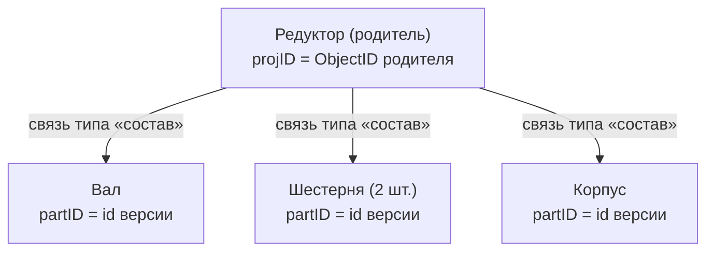

# Связи и состав изделия

Объекты в IPS не существуют поодиночке — они связаны. Сборка состоит из деталей, документ относится
к изделию, узел входит в несколько изделий. Эти отношения выражаются **связями**, а структура
«родитель → потомки» называется **составом**.

## Простыми словами

Аналогия — спецификация сборочного чертежа. Сборка «Редуктор» **состоит из** деталей: «Вал»,
«Шестерня», «Корпус». Каждая строка спецификации — это **связь** между сборкой (родитель) и
деталью (потомок). У связи есть **тип** («входит в состав», «является документом» и т.п.) и
могут быть собственные характеристики (например, количество: «Шестерня — 2 шт.»).



## Точные детали

### Анатомия связи

Связь **направленная**: от родителя к потомку. У неё есть ключевые поля (в `aioips` — схема
`Relation`):

| Поле | Что это | id-пространство |
|---|---|---|
| `proj_id` (`ProjID`) | Родитель связи | **ObjectID родителя** (F_OBJECT_ID, объект) |
| `part_id` (`PartID`) | Потомок связи | **id ВЕРСИИ потомка** (F_ID, версия) |
| `relation_type` | Тип связи (состав, документ, …) | — |
| `part_object_id` (`PartObjectID`) | ObjectID потомка (0, если связь не по версии) | objectID потомка |
| собственные атрибуты | характеристики самой связи (например, количество) | — |

!!! warning "projID — это объект, partID — это версия (разные пространства!)"
    Это прямое следствие [двухуровневой идентичности](data-model.md). Родитель в связи задаётся
    своим **ObjectID** (`projID` = F_OBJECT_ID родителя), а потомок — **id своей версии**
    (`partID` = F_ID). Нельзя взять `relation.part_id` и подать в `object_get` — тот ждёт
    `objectID`, и вернёт `None`. Чтобы получить объект-потомок, нужен его objectID (например,
    из `part_object_id` или из результата состава).

!!! warning "RelationID нестабилен — не кэшируйте его"
    Числовой идентификатор связи **меняется** после `checkOut`/`checkIn` родителя. Не используйте
    его как долговременный ключ. Для устойчивой идентификации связи берите её **GUID** или тройку
    (`proj_id`, `part_id`, `relation_type`). По GUID связь достаётся методом
    `relation_get_by_guid`, по числовому id — `relation_get` (но id может «протухнуть»).

### Применяемость

Не любые объекты можно связать. **Применяемость** — это правило, какие связи разрешены: тройка
(тип родителя, тип связи, тип потомка). Метаданные применяемости отдаются методами раздела
`metadata` (например, `applicability`, `can_enters_in`). Если связь нарушает применяемость,
сервер её не создаст.

### Состав изделия

**Состав** — это набор дочерних объектов родителя, связанных структурной связью. В `aioips`
два метода:

| Метод | Что принимает | Когда применять |
|---|---|---|
| `object_composition(project_version_id)` | **id ВЕРСИИ** проекта + правило контекста версий | Простой запрос состава по версии проекта |
| `object_composition_with_params(object_id, relation_type_id, part_type_ids)` | **objectID** родителя + фильтры по типу связи и типам потомков | Когда нужно отфильтровать состав по типам |

!!! warning "У composition_with_params почти всегда нужны part_type_ids"
    Без указания `part_type_ids` (типы дочерних объектов) сервер обычно возвращает **пустой
    список**. Передавать `null` нельзя — будет ошибка 500; передавайте список типов (`aioips`
    подставляет `[]`, но тогда результат, как правило, пуст). Также: оба метода `composition`
    — это POST, но **без мутаций**, чистое чтение.

!!! warning "Архив документа — это НЕ состав"
    Принадлежность документа архиву задаётся **атрибутом-ссылкой** (`ftObjectLink`, в одной из
    боевых БД атрибут «Архив» = id 1029), а не структурной связью/составом. Поэтому документы
    архива через `composition` **не найти** — их ищут через [Поиск](search.md) по этой ссылке.
    См. также [Атрибуты](attributes.md).

## Как это выглядит в коде aioips

!!! example "Получить состав изделия с фильтром по типам"
    ```python
    async with IPSClient(config=config) as ips:
        parts = await ips.object_composition_with_params(
            102550,                 # objectID родителя
            relation_type_id=4,     # тип связи «состав»
            part_type_ids=[1127],   # какие типы потомков вернуть
        )
        for part in parts:
            print(part.object_id, part.caption)
    ```

!!! example "Прочитать одну связь и понять её концы"
    ```python
    async with IPSClient(config=config) as ips:
        relation = await ips.relation_get(700123)
        if relation is not None:
            print("родитель (objectID):", relation.proj_id)
            print("потомок  (id версии):", relation.part_id)
            print("тип связи:", relation.relation_type)
    ```

## Что дальше

- [Объект и версия](data-model.md) — почему `projID` и `partID` из разных пространств.
- [Поиск объектов](search.md) — как искать состав и принадлежность через условия (`entersIn`,
  `consistFrom`, ссылки).
