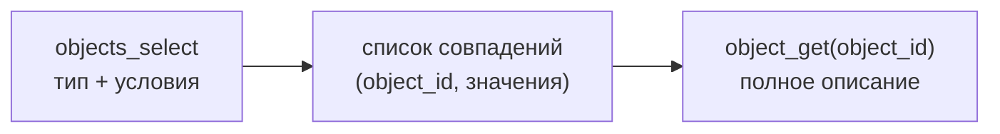

# Поиск объектов

Когда вы не знаете идентификаторы объектов заранее, их находят **поиском** — по типу и условиям
на значения атрибутов. Это основной способ «нащупать» нужные объекты, прежде чем читать их целиком.

## Простыми словами

Аналогия — SQL-запрос `SELECT ... WHERE ...`, но по объектам IPS. Вы говорите: «найди все объекты
**типа** "Документ", у которых **атрибут** "Архив" **равен** вот этому архиву». На выходе —
список найденных объектов (их идентификаторы и запрошенные значения), которые потом можно
догрузить через `object_get`.



## Точные детали

Поиск выполняет метод `objects_select(object_type_id, conditions=..., attribute_ids=...)`. Он
строится из:

- **тип объектов** (`object_type_id`) — обязателен, поиск всегда в рамках типа;
- **условия** (`conditions`) — список `SelectCondition`, каждое сравнивает значение атрибута с
  эталоном;
- **какие атрибуты вернуть** (`attribute_ids`) — значения этих атрибутов попадут в результат.

### Условие поиска (`SelectCondition`)

Каждое условие — это «атрибут — оператор — значение», плюс как соединять с соседними условиями.
Ключевые части (соответствуют `ConditionStructure` ядра IPS):

| Часть | Что задаёт | Перечисление в `aioips` |
|---|---|---|
| `attribute_id` | какой атрибут сравнивать | — |
| `relational_operator` | как сравнивать | `RelationalOperator` |
| `value` / `value2` | с чем сравнивать (для `between` — диапазон) | — |
| `content` | в каком представлении сравнивать (текст/id/дата/…) | `ColumnContent` |
| `logical_operator` | как соединить с предыдущим условием (И/ИЛИ/НЕ) | `LogicalOperator` |
| `group_id` | скобки группировки условий | — |

**Операторы** (`RelationalOperator`) — выборка частых:
`EQUAL`/`NOT_EQUAL` (точное совпадение), `SUBSTRING` (содержит подстроку),
`START_STRING`/`END_STRING` (начинается/кончается), `BETWEEN` (диапазон `value`..`value2`),
`STRING_TEMPLATE` (шаблон с `?`/`*`), `IN`/`NOT_IN` (вхождение в перечень),
`IN_SELECTION` (в именованной выборке), `ENTERS_IN` (входит в состав указанного объекта),
`CONSIST_FROM` (состоит из указанного), `EMPTY`/`NOT_EMPTY`, `ATTRIBUTE_EXISTS`,
`LAST_N_DAYS`/`NEXT_N_DAYS` (окно по дате), `MAX_VERSION`/`MIN_VERSION` (крайняя версия). Полный
набор — в перечислении `RelationalOperator`.

**Связки** (`LogicalOperator`): `NONE` (первое условие), `AND`, `OR`, `NOT`; скобки — через
`group_id`.

### `content=id` — для условий по ссылкам

`ColumnContent` указывает, в каком виде сравнивать атрибут: `TEXT` (отображаемый текст),
`ID` (по идентификатору), `DATE`, `VALUE` (сырое типизированное значение), `STRING`.

!!! warning "Ссылку на объект ищите по content=ID"
    Для условий по **ссылочным** атрибутам (`ftObjectLink`) сравнение ведётся по **id связанного
    объекта** — задавайте `content=ColumnContent.ID` и в `value` кладите id объекта-цели. Это
    канонический способ найти документы архива: тип «Документ» + условие
    «атрибут "Архив" `EQUAL` `<id архива>` с `content=ID`». Если оставить `content=TEXT`, поиск
    по ссылке работать не будет так, как ожидается. См. [Атрибуты](attributes.md) и
    [Связи и состав](relations-composition.md) (почему архив — это ссылка, а не состав).

### Контекст версий

!!! warning "Один и тот же запрос может вернуть разные версии"
    Результат поиска зависит от **контекста версий** (правила фильтрации версий на сервере): один
    и тот же запрос с разным правилом вернёт разные версии объектов. Для воспроизводимости
    **фиксируйте** условия и правило версий — иначе результаты могут «плавать» между запусками.

### Пагинация — keyset, не offset

!!! warning "Пагинация по ключу, а не по смещению"
    IPS не использует привычный `offset`/`limit`. Постраничность — **keyset**: размер страницы
    задаётся (в `aioips` — `record_count`), а следующая страница берётся от последнего ключа
    предыдущей. Признак конца — служебный флаг (`Eof` в расширенных свойствах), а не «закончились
    строки при offset». Не пытайтесь листать через `offset` — его тут нет.

## Как это выглядит в коде aioips

!!! example "Найти все документы архива (ссылка по content=ID)"
    ```python
    from aioips.common.enumerations import RelationalOperator, ColumnContent
    from aioips.schemas.objects import SelectCondition

    async with IPSClient(config=config) as ips:
        # тип 1742 = «Документ», атрибут 1029 = «Архив» (ftObjectLink)
        results = await ips.objects_select(
            object_type_id=1742,
            conditions=[
                SelectCondition(
                    attribute_id=1029,
                    relational_operator=RelationalOperator.EQUAL,
                    value=1240084,                 # id объекта-архива
                    content=ColumnContent.ID,      # сравнивать по id ссылки!
                )
            ],
            attribute_ids=[9, 10],                 # какие значения вернуть
        )
        object_ids = [r.object_id for r in results]   # затем object_get(...) по каждому
    ```

`objects_select` возвращает список `ObjectSelectResult`: у каждого `object_id` найденного объекта
(это **objectID** — его можно сразу подать в `object_get`) и `attributes` — значения тех
атрибутов, что вы запросили в `attribute_ids`.

## Что дальше

- [Объект и версия](data-model.md) — `object_id` из результатов поиска готов к `object_get`.
- [Атрибуты и типы](attributes.md) — по каким значениям и как вы фильтруете.
- Практические сценарии поиска — в [Руководствах](../guides/index.md).
