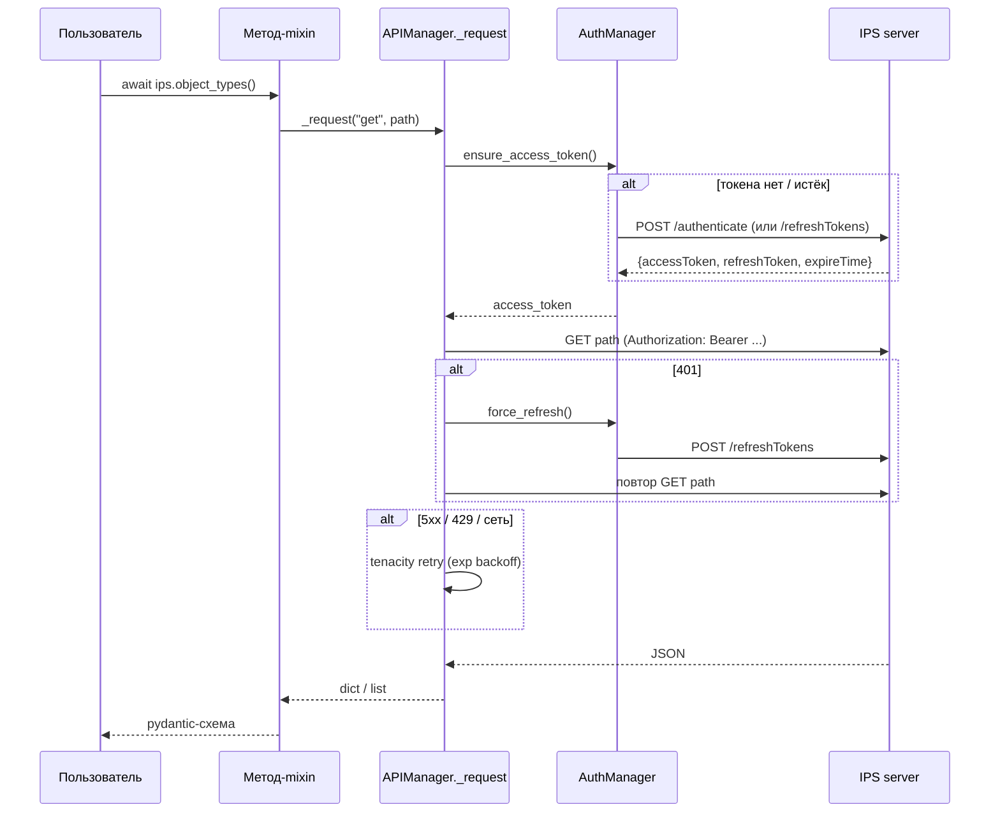

# Слои и поток запроса

- Дата: 2026-06-24

Карта слоёв (см. [[ADR-0001-client-architecture]]):

```
IPSClient (client.py)
  └─ mixin-разделы (methods/<раздел>/<метод>.py)   ← публичные методы, возвращают схемы
       └─ APIManager._request (core/core.py)        ← авторизация + повторы + ошибки
            ├─ AuthManager (core/auth.py)           ← JWT: authenticate / refresh / 401
            ├─ SessionManager (core/sessions.py)    ← aiohttp.ClientSession
            └─ exceptions (core/exceptions.py)      ← маппинг HTTP-кода в исключение
  schemas/<раздел>/<метод>.py                       ← pydantic-модели (IPSModel + to_camel)
  common/enumerations/                              ← доменные enum'ы
  infrastructure/logging/                           ← структурное логирование
```

Поток одного вызова метода:


